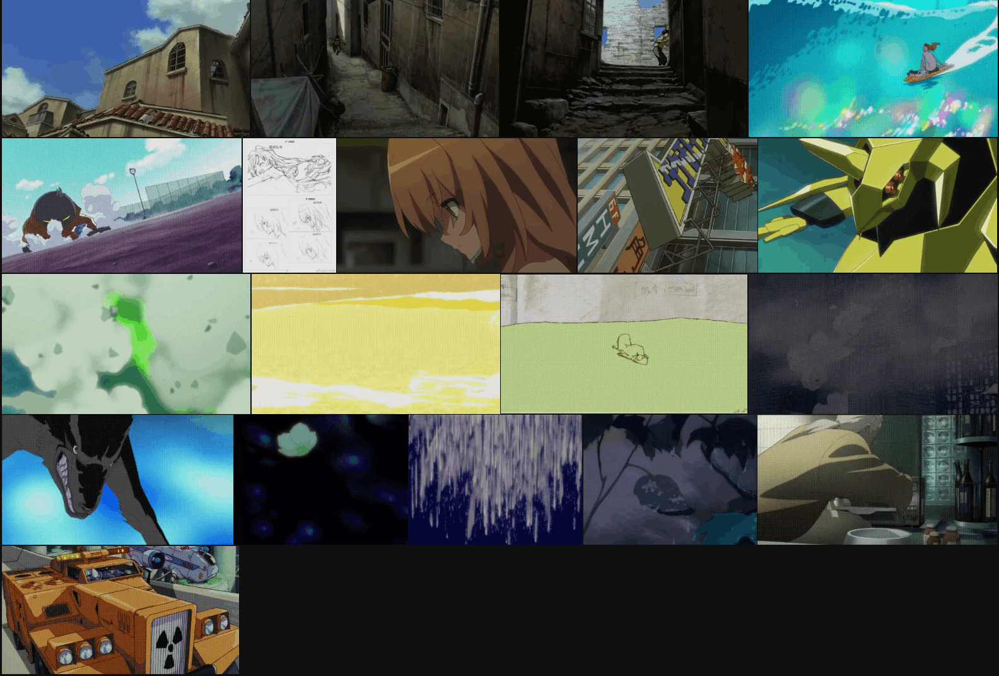

# Anime Keyframes Gallery

[![CC0 1.0][cc-zero-image]][cc-zero]

[cc-zero]: http://creativecommons.org/licenses/zero/1.0/
[cc-zero-image]: https://i.creativecommons.org/l/zero/1.0/88x31.png
[cc-zero-shield]: https://img.shields.io/badge/License-CC%20ZERO%201.0-lightgrey.svg

[](https://scillidan.github.io/anime-keyframes-gallery) [](https://gm-anime-keyframes-gallery.vercel.app/)

Archive from [猫与牛仔裤的个人作画分享](https://jandan.net/bbs#/topic/520).

PS: On source url, some `.gif` cannot be downloaded. I only have a phone number and can't find my Weibo account back. So, I will update them in the long later.



## Preview on local

```sh
git clone https://github.com/scillidan/anime-keyframes-gallery
cd anime-keyframes-gallery
npm install -g serve
serve -s . -p 4321
```

## How to make

1. Download `.gif`.
2. Convert `.gif` to `.mp4`:
	```sh
	ffmpeg -i $1.gif -movflags faststart -pix_fmt yuv420p -vf "scale=trunc(iw/2)*2:trunc(ih/2)*2" $1.mp4
	```
3. Extract `_poster.jpg` from `.mp4`:
	```sh
	ffmpeg -i $1.mp4 -vframes 1 $1_poster.jpg
	```
4. Edit [index.html](index.html). I recorded the desktop, see it on [Youtube](https://youtu.be/uVJlbPNOkQU) or [bilibili](https://www.bilibili.com/video/BV1Mi421k7Bp/).

## Attribute

lightGallery's license is [here](https://www.lightgalleryjs.com/license/).  
Video clips in `media/**`, text data in `index.html` belong to 猫与牛仔裤.  
Others is under [CC0 1.0](https://creativecommons.org/publicdomain/zero/1.0/).
