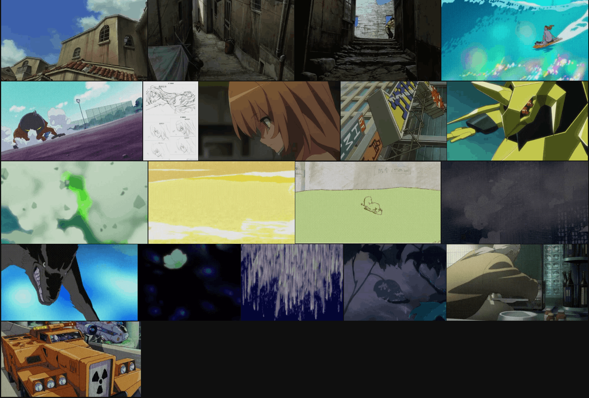

# Anime Keyframes Gallery

Archive from [猫与牛仔裤的个人作画分享](https://jandan.net/bbs#/topic/520).

PS: Some `.gif` files on the source URL cannot be downloaded. I only have a phone number and can't recover my Weibo account. So, I will update them much later.



## How to make

1. Download `.gif`.
2. Convert `.gif` to `.mp4`:
	```sh
	ffmpeg -i $1.gif -movflags faststart -pix_fmt yuv420p -vf "scale=trunc(iw/2)*2:trunc(ih/2)*2" $1.mp4
	```
3. Extract `_poster.jpg` from `.mp4`:
	```sh
	ffmpeg -i $1.mp4 -vframes 1 $1_poster.jpg
	```
4. Modify `index.html`.

## Attribute

lightGallery's license is [here](https://www.lightgalleryjs.com/license/).  
Video clips in `media/**`, text content in `index.html` belong to 猫与牛仔裤.  
Others is under `MIT`.